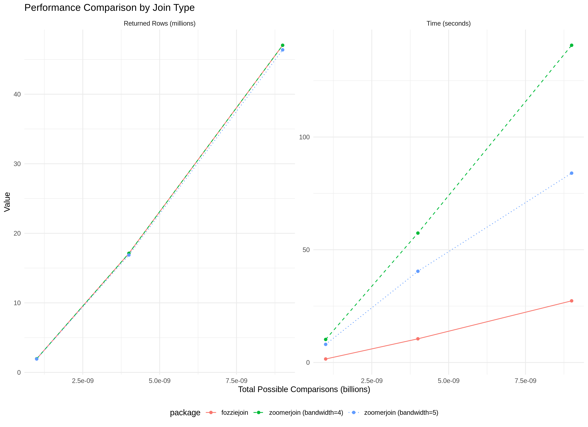
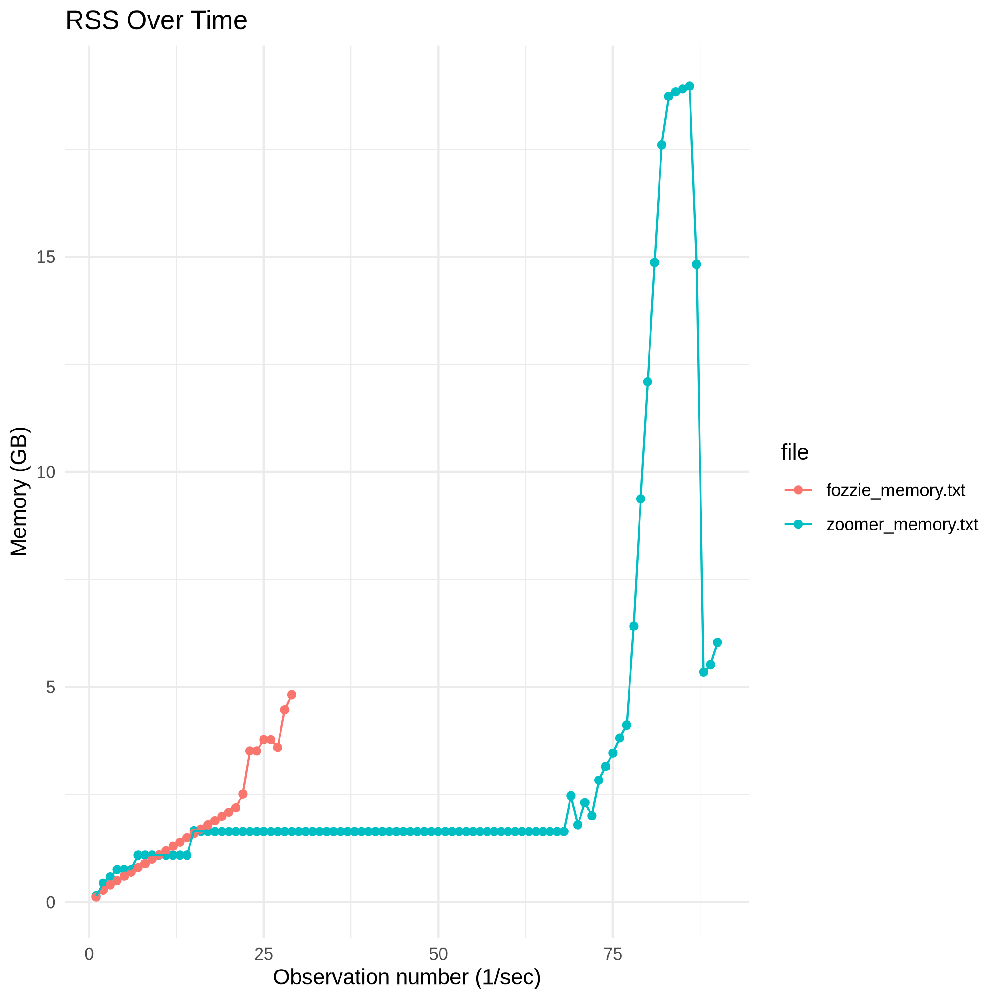

# Zoomerjoin and Fuzzyjoin: Performance Tradeoffs

## Introduction

A repo with code examples for some comparative benchmarking between `zoomerjoin`
and `fozziejoin`. The primary goals of this repo are two:

- Perform a comparative benchmark between the two packages
- Identify areas where each package excels and struggles
- Identify any hotspots in the `zoomerjoin` and `fozziejoin` packages

The benchmark tests were designed around the motivating examples used in the
`zoomerjoin` documentation.

As with any benchmarking activity, details matter and skepticism is warranted.
This activity has already led to significant performance improvements in the
`fozziejoin` package.

This repo is still a work in progress. A wish list is below.

- [ ] Add euclidean benchmarks
- [ ] Better parameterization config for `zoomerjoin`: it'd be nice to have a more fleshed out grid search strategy

## Who I am

I am the original author of the `fozziejoin` package, and have made minor
contributions to the `zoomerjoin` package.

## Getting Started

### Requirements

- A modern version of R (4.5 or greater)
- The `renv` package
- Bash with the `pidstat` command
- Cargo/Rust for compiling Rust packages from source

### Installing R Dependencies

First, clone the repo and make it the working directory:

```sh
git clone https://github.com/JonDDowns/zoomer_fozzie_comp
cd ./zoomer_fozzie_comp
```

Next, use `renv` to restore the workspace.

```r
# install.packages('renv')
library(renv)
renv::restore()
```

Note that a specific commit of `fozziejoin` is being installed from GitHub.
CRAN is not used for this package.

### Download Dime Contributors .Rdata File

https://data.stanford.edu/dime

Place in [./data subdirectory](./data/).

### Update Config File

The [config.yaml](./config.yaml) file specifies all parameters for the
scripts. This allows you to specify the sample size for benchmarks, parameters
for the join operations, the number of system threads to use, and the number
of runs to do in the benchmarking script.

### Run All Scripts

The [run_all.sh](./run_all.sh) script runs all benchmark scripts.

```sh
# chmod +x run_all.sh
./run_all.sh
```

This script first runs a single `fozziejoin` join and `zoomerjoin` join at the
max sample size from the config file. For `zoomerjoin`, it defaults to the max
value of the `BANDWIDTHS` parameter for the single join run. The memory
utilization is also monitored by second using the `pidstat` shell command.
The respective reports are saved at `results/fozzie_memory.txt` and
`results/zoomer_memory.txt`. The raw outputs are excluded from `git` version
control to prevent unnecessary disclosure of user environment data.

Next, it generates a plot of the memory utilization for each process and
stores those results at `./results/memory_plot.png`.

Third, it runs a more comprehensive benchmark for `fozziejoin` and
`zoomerjoin`. For `fozziejoin`, a benchmark is run for each sample size
using parameters from [./config.yaml](./config.yaml). `zoomerjoin`
does this as well, except it will run at all possible parameterizations
from the config file. For example, if `BANDWIDTHS: [4, 5]`, it will run
benchmarks first with `BANDWIDTH=4`, then with `BANDWIDTH=5`.

## Findings

Findings are reported from my local machine. Results will vary based on
hardware.

### Jaccard String Joins

In initial testing, `zoomerjoin` was faster for jaccard distances at sufficient
scale (joining two dfs with 100,000 rows). Based on these results, I revisited
the implementation for Jaccard string joins in `fozziejoin` and discovered a
more efficient strategy. The benchmarks were then updated (see below).



Next, I wanted to explore a timeline of total memory consumption across both
packages for the Jaccard case. For this, I used `pidstat` to track total
memory consumption over time for a single run of each join. Samples were taken
once per second. I'm using Resident Set Size (RSS) as the metric here.



Interestingly, `zoomerjoin` has a large spike in memory towards the end of its
runtime. I made a lightly modified version of the `zoomerjoin` package that
appends timestamps to jaccard joins when `progress = TRUE` and I added similar
statements to the R code. You can see the modified `zoomerjoin`
[here](https://github.com/JonDDowns/zoomerjoin/tree/timeprint). This allows
us to better pinpoint exactly when this spike occurs. It appears the spike
occurs for this section of code from the Rust function.

```rust
Robj::try_from(&out_arr).into()
```

At this point in the Rust script, the Jaccard join has completed and linked
pairs have been identified. This code converts the matched indices to an R
object, where the join is finalized using `dplyr::bind_cols()`. This step takes
around 18 seconds to run at `n=500,000`. Peak RSS occurs during this step.
